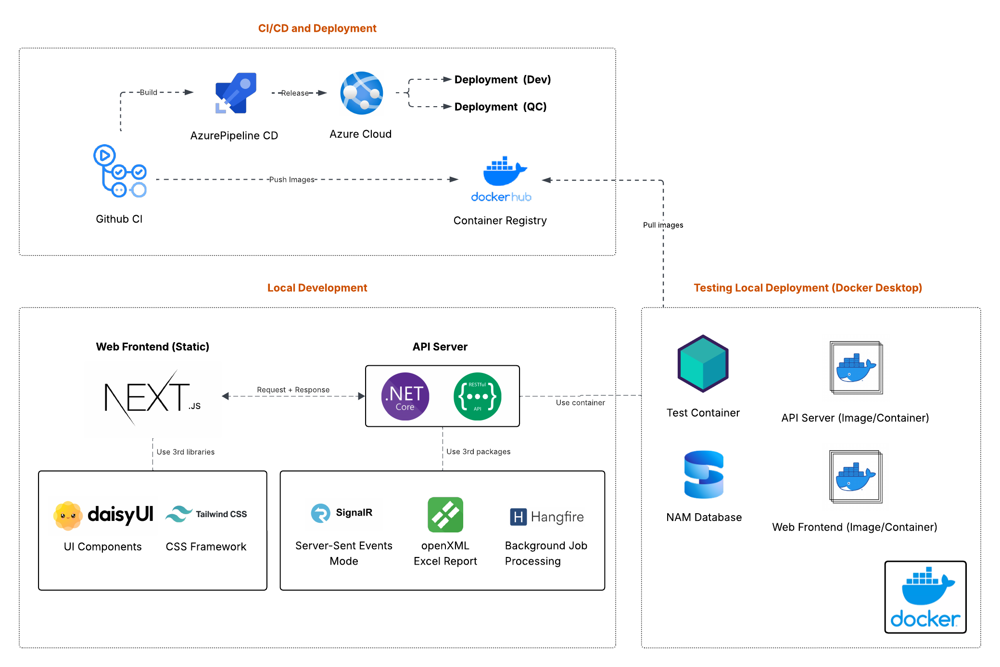
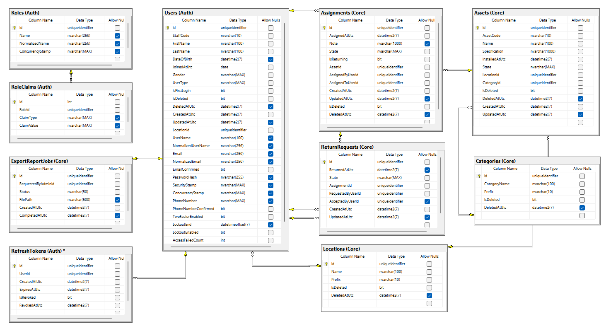

# Nash Asset Management System (R2E Training Bootcamp)


A project **Asset Management System** built for managing organizational assets, assignments, and returns. This project demonstrates enterprise-grade full-stack development with modern architecture patterns and best practices.

---

## 🛠️ Tech Stack

- **Backend**: .NET 10, ASP.NET Core, Entity Framework Core, MediatR, FluentValidation, Serilog
- **Frontend**: Next.js 16, React 19, Redux Toolkit, TypeScript, Tailwind CSS 4, DaisyUI
- **Real-time**: SignalR
- **Database**: SQL Server 2025
- **Infrastructure**: Azure, Docker, Bicep, Azure Pipelines
- **Architecture**: Clean Architecture, CQRS, Feature-based structure

---

## 📋 Project Scope & Features

### **Staff Portal**

- Dashboard, Asset browsing, My assignments, Return requests, Profile management

### **Admin Portal**

- Asset management (CRUD), Category management, Assignments, Return approvals, User management, Reports

### **Enhancements**

- Real-time notifications via SignalR
- Role-based access control
- Responsive design
- Multi-environment support (DEV, QC)

### **Browser Support**

- Chrome, Firefox, Edge, Safari, Opera, Vivaldi
- Mobile browsers (iOS Safari, Chrome Mobile)

---

## 📡 Current Supporting APIs

| Layer            | Endpoint                             | Method   | Description                            | Status       |
| ---------------- | ------------------------------------ | -------- | -------------------------------------- | ------------ |
| **Public API**   | `/api/v1/assets`                     | GET      | List all assets (paginated, filtered)  | ✅ Completed |
| **Public API**   | `/api/v1/assets/{id}`                | GET      | Asset details                          | ✅ Completed |
| **Public API**   | `/api/v1/categories`                 | GET      | List all categories                    | ✅ Completed |
| **Public API**   | `/api/v1/categories/{id}`            | GET      | Category details                       | ✅ Completed |
| **User API**     | `/api/v1/assignments`                | GET      | Get user's asset assignments           | ✅ Completed |
| **User API**     | `/api/v1/assignments/{id}`           | GET      | Assignment details                     | ✅ Completed |
| **User API**     | `/api/v1/returns`                    | POST     | Create asset return request            | ✅ Completed |
| **User API**     | `/api/v1/returns`                    | GET      | Get user's return requests             | ✅ Completed |
| **User API**     | `/api/v1/profile`                    | GET      | Get current user profile               | ✅ Completed |
| **User API**     | `/api/v1/profile`                    | PUT      | Update user profile                    | ✅ Completed |
| **Admin API**    | `/api/v1/admin/assets`               | GET      | List all assets with full details      | ✅ Completed |
| **Admin API**    | `/api/v1/admin/assets`               | POST     | Create new asset                       | ✅ Completed |
| **Admin API**    | `/api/v1/admin/assets/{id}`          | GET      | Asset details                          | ✅ Completed |
| **Admin API**    | `/api/v1/admin/assets/{id}`          | PUT      | Update asset                           | ✅ Completed |
| **Admin API**    | `/api/v1/admin/assets/{id}`          | DELETE   | Delete asset                           | ✅ Completed |
| **Admin API**    | `/api/v1/admin/categories`           | GET/POST | List categories / Create category      | ✅ Completed |
| **Admin API**    | `/api/v1/admin/categories/{id}`      | GET/PUT  | Category details / Update category     | ✅ Completed |
| **Admin API**    | `/api/v1/admin/assignments`          | GET      | List all assignments (paginated)       | ✅ Completed |
| **Admin API**    | `/api/v1/admin/assignments`          | POST     | Create new assignment                  | ✅ Completed |
| **Admin API**    | `/api/v1/admin/assignments/{id}`     | GET/PUT  | Assignment details / Update assignment | ✅ Completed |
| **Admin API**    | `/api/v1/admin/returns`              | GET      | List return requests (searchable)      | ✅ Completed |
| **Admin API**    | `/api/v1/admin/returns/{id}`         | GET      | Return request details                 | ✅ Completed |
| **Admin API**    | `/api/v1/admin/returns/{id}/approve` | POST     | Approve return request                 | ✅ Completed |
| **Admin API**    | `/api/v1/admin/returns/{id}/reject`  | POST     | Reject return request                  | ✅ Completed |
| **Admin API**    | `/api/v1/admin/users`                | GET      | List users (paginated, searchable)     | ✅ Completed |
| **Admin API**    | `/api/v1/admin/reports/assets`       | GET      | Generate asset report                  | ✅ Completed |
| **Admin API**    | `/api/v1/admin/reports/assignments`  | GET      | Generate assignment report             | ✅ Completed |
| **Identity API** | `/api/v1/auth/login`                 | POST     | User login                             | ✅ Completed |
| **Identity API** | `/api/v1/auth/logout`                | POST     | User logout                            | ✅ Completed |
| **Identity API** | `/api/v1/auth/me`                    | GET      | Get current user info                  | ✅ Completed |
| **SignalR Hub**  | `/hubs/user-session`                 | WS       | Real-time user session notifications   | ✅ Completed |

---

## 🖼️ Current Supporting Pages

| Layer          | Route                 | Method | Description                  | Status       |
| -------------- | --------------------- | ------ | ---------------------------- | ------------ |
| **Admin Site** | `/dashboard`          | GET    | Admin overview & statistics  | ✅ Completed |
| **Admin Site** | `/assets`             | GET    | Asset management list        | ✅ Completed |
| **Admin Site** | `/assets/create`      | GET    | Create new asset page        | ✅ Completed |
| **Admin Site** | `/assets/[id]`        | GET    | Edit asset details page      | ✅ Completed |
| **Admin Site** | `/categories`         | GET    | Category management list     | ✅ Completed |
| **Admin Site** | `/categories/create`  | GET    | Create new category page     | ✅ Completed |
| **Admin Site** | `/categories/[id]`    | GET    | Edit category details page   | ✅ Completed |
| **Admin Site** | `/assignments`        | GET    | Assignment management list   | ✅ Completed |
| **Admin Site** | `/assignments/create` | GET    | Create new assignment page   | ✅ Completed |
| **Admin Site** | `/assignments/[id]`   | GET    | Edit assignment details page | ✅ Completed |
| **Admin Site** | `/returns`            | GET    | Return requests management   | ✅ Completed |
| **Admin Site** | `/returns/[id]`       | GET    | Return request details page  | ✅ Completed |
| **Admin Site** | `/users`              | GET    | User management list         | ✅ Completed |
| **Admin Site** | `/reports`            | GET    | Reports generation & export  | ✅ Completed |
| **Staff Site** | `/dashboard`          | GET    | Staff overview               | ✅ Completed |
| **Staff Site** | `/assets`             | GET    | Browse company assets        | ✅ Completed |
| **Staff Site** | `/assets/[id]`        | GET    | Asset details                | ✅ Completed |
| **Staff Site** | `/assignments`        | GET    | My asset assignments         | ✅ Completed |
| **Staff Site** | `/assignments/[id]`   | GET    | Assignment details           | ✅ Completed |
| **Staff Site** | `/returns`            | GET    | My return requests           | ✅ Completed |
| **Staff Site** | `/returns/create`     | GET    | Create return request        | ✅ Completed |
| **Staff Site** | `/profile`            | GET    | User profile & settings      | ✅ Completed |
| **Auth**       | `/login`              | GET    | Login page                   | ✅ Completed |
| **Auth**       | `/login`              | POST   | Submit login credentials     | ✅ Completed |
| **Auth**       | `/logout`             | GET    | Logout action                | ✅ Completed |
| **Global**     | `[...slug]`           | ALL    | 404 Error page               | ✅ Completed |

---

## 🏗️ Architecture

### **System Architecture Overview**



### **Database Schema (ERD)**



---

## 📂 Project Structure

```
.
├── Backend/
│   └── NashAssetManagement/
│       ├── src/
│       │   ├── NashAssetManagement.Domain/
│       │   │   ├── Entities/              # Core domain entities
│       │   │   ├── Enums/                 # Domain enumerations
│       │   │   ├── Constants/             # Business constants
│       │   │   └── Utilities/             # Domain utilities
│       │   ├── NashAssetManagement.Application/
│       │   │   ├── UseCases/              # CQRS handlers
│       │   │   │   ├── Assets/
│       │   │   │   ├── Assignments/
│       │   │   │   ├── Auth/
│       │   │   │   ├── Categories/
│       │   │   │   ├── Report/
│       │   │   │   ├── ReturnRequests/
│       │   │   │   └── Users/
│       │   │   ├── Abstractions/          # Application interfaces
│       │   │   └── ServiceCollectionExtensions.cs
│       │   ├── NashAssetManagement.Persistence/
│       │   │   ├── AppDbContext.cs        # EF Core DbContext
│       │   │   ├── Migrations/            # DB migrations
│       │   │   ├── Configurations/        # Entity mappings
│       │   │   └── SeedData/              # Development seed data
│       │   ├── NashAssetManagement.Infrastructure/
│       │   │   └── # External services, integrations
│       │   └── NashAssetManagement.WebAPI/
│       │       ├── Program.cs             # ASP.NET Core setup
│       │       ├── Controllers/           # API endpoints
│       │       ├── Hubs/                  # SignalR hubs
│       │       ├── Middlewares/           # Custom middleware
│       │       ├── Filters/               # Exception filters
│       │       ├── Configuration/         # Settings
│       │       └── Realtime/              # Real-time services
│       ├── tests/
│       │   └── NashAssetManagement.UnitTests/
│       │       └── # Unit & integration tests
│       ├── Dockerfile
│       └── NashAssetManagement.slnx
├── Frontend/
│   ├── app/                          # Next.js pages & layout
│   │   ├── (admin)/                  # Admin routes
│   │   ├── (staff)/                  # Staff routes
│   │   └── layout.tsx                # Root layout
│   ├── features/                     # Feature modules
│   │   ├── Assets/                   # Asset feature
│   │   ├── assignments/              # Assignment feature
│   │   ├── auth/                     # Authentication
│   │   ├── report/                   # Reporting
│   │   ├── returns/                  # Return requests
│   │   ├── users/                    # User management
│   │   └── shared/                   # Shared components & slices
│   ├── lib/
│   │   ├── api/                      # API client & routes
│   │   ├── config/                   # Configuration
│   │   └── redux/                    # Redux store setup
│   ├── public/                       # Static assets
│   ├── Dockerfile
│   ├── package.json
│   └── next.config.ts
├── infra/
│   ├── main.bicep                    # Azure infrastructure
│   ├── main.parameters.json          # Deployment parameters
│   └── azure-pipelines.infra.yml     # IaC pipeline
├── secrets/                          # Environment secrets (git-ignored)
├── docker-compose.yaml               # Local development setup
├── azure-pipelines.build.yml         # CI build pipeline
├── azure-pipelines.release.yml       # CD release pipeline
└── README.md
```

---

## 🚀 Running the Project

### **Prerequisites**

Ensure you have the following installed:

- **Node.js**: v20.x or higher (LTS)
- **npm**: v10.x or higher
- **.NET SDK**: v10.0 or higher
- **Docker & Docker Compose**: Latest version
- **SQL Server** (optional - can use Docker)
- **Git**: For version control

### **1. Clone Repository & Install Dependencies**

```bash
git clone https://github.com/phongnguyend/Rookies2026Batch9Net1.git
cd Project
cd Backend/NashAssetManagement
cd ../../Frontend
npm install
```

### **2. Environment Configuration**

Create `.env.local` files in `Frontend/` and `secrets/` folders:

**Frontend/.env.local**:

```env
NEXT_PUBLIC_API_URL=http://localhost:5000
NEXT_PUBLIC_APP_NAME=Nash Asset Management
```

**Backend - secrets/nam-api.env**:

```env
ConnectionStrings__DefaultConnection=Server=nam-db;Database=NashAssetManagement;User Id=sa;Password=YourPassword123!;Encrypt=false;
```

**Database - secrets/nam-db.env**:

```env
MSSQL_SA_PASSWORD=YourPassword123!
```

### **3. Start Docker Infrastructure**

```bash
docker-compose up -d
docker-compose ps
```

This starts:

- **SQL Server 2025** (`nam-db` on port 1433)
- **API** (`nam-api` on port 5000)
- **Frontend** (`nam-web` with NGINX)

### **4. Run Backend Services**

```bash
cd Backend/NashAssetManagement
dotnet watch run --project src/NashAssetManagement.WebAPI
```

### **5. Run Frontend Development Server**

```bash
cd Frontend
npm run dev
```

### **6. Database Setup**

On first run, the application automatically:

- Runs EF Core migrations
- Seeds development data
- Creates necessary tables

To manually reset the database:

```bash
cd Backend/NashAssetManagement
dotnet ef database drop
dotnet ef database update
```

---

## 🧪 Testing

### **Run Unit Tests**

```bash
cd Backend/NashAssetManagement
dotnet test tests/NashAssetManagement.UnitTests/NashAssetManagement.UnitTests.csproj
```

### **Run with Code Coverage**

```bash
dotnet test \
  /p:CollectCoverage=true \
  /p:CoverletOutputFormat=cobertura \
  "/p:Include=\"[NashAssetManagement.Application]*,[NashAssetManagement.Domain]*\""
```

---

## 🏛️ Architecture Patterns & Design Decisions

### **Clean Architecture Layers**

1. **Domain Layer** - Business entities, rules, and constants
2. **Application Layer** - Use cases, handlers, and abstractions
3. **Infrastructure Layer** - External services and data access
4. **Persistence Layer** - EF Core, migrations, DbContext
5. **Presentation Layer** - Controllers, endpoints, API contracts

### **Key Patterns Used**

- **CQRS** with MediatR - Separates read/write operations
- **Repository Pattern** - Data access abstraction
- **Dependency Injection** - Loose coupling
- **Options Pattern** - Configuration management
- **Builder Pattern** - Complex object construction in tests
- **Mediator Pattern** - Decoupled request handling
- **Observer Pattern** - SignalR real-time updates

### **Frontend Architecture**

- **Redux Toolkit** - Predictable state management
- **Feature-based Structure** - Organized by business domains
- **RTK Query** - API data fetching & caching
- **React Hook Form** - Efficient form handling
- **Zod** - Runtime type safety & validation

---

## 📊 CI/CD Pipeline

### **Azure Pipelines Stages**

1. **BuildDotNet** - .NET build, test, publish
   - Restore dependencies
   - Vulnerability scanning
   - Build & Test
   - Publish artifacts

2. **BuildReactJs** - Frontend build
   - Install dependencies
   - Build Next.js app
   - Run tests
   - Build Docker image

3. **Deploy** - Deployment to Azure
   - Deploy API to App Service
   - Deploy Web to App Service
   - Database migrations

---

## 📚 Reference Links

### 🏗️ **Architecture & Patterns**

- [Clean Architecture - Robert C. Martin](https://blog.cleancoder.com/uncle-bob/2012/08/13/the-clean-architecture.html)
- [CQRS Pattern - Martin Fowler](https://martinfowler.com/bliki/CQRS.html)
- [Vertical Slice Architecture](https://jimmybogard.com/vertical-slice-architecture/)
- [Repository Pattern](https://learn.microsoft.com/en-us/dotnet/architecture/microservices/microservice-ddd-cqrs-patterns/infrastructure-persistence-layer-design)

### 🔧 **.NET & Backend**

- [Entity Framework Core](https://learn.microsoft.com/en-us/ef/core/)
- [MediatR Documentation](https://github.com/jbogard/MediatR/wiki)
- [FluentValidation](https://docs.fluentvalidation.net/)
- [Serilog Logging](https://serilog.net/)
- [SignalR Real-time Communication](https://learn.microsoft.com/en-us/aspnet/core/signalr/introduction)
- [Hangfire Background Jobs](https://www.hangfire.io/)
- [Global Error Handling in ASP.NET Core](https://www.milanjovanovic.tech/blog/global-error-handling-in-aspnetcore-8)

### ⚛️ **Frontend & React**

- [Next.js 16 Documentation](https://nextjs.org/docs)
- [React 19](https://react.dev)
- [Redux Toolkit](https://redux-toolkit.js.org/)
- [React Hook Form](https://react-hook-form.com/)
- [Zod Validation](https://zod.dev/)
- [Tailwind CSS](https://tailwindcss.com/)
- [DaisyUI Components](https://daisyui.com/)

### ☁️ **Azure & Infrastructure**

- [Azure App Service](https://learn.microsoft.com/en-us/azure/app-service/)
- [Bicep Templates](https://learn.microsoft.com/en-us/azure/azure-resource-manager/bicep/overview)
- [Azure Pipelines](https://learn.microsoft.com/en-us/azure/devops/pipelines/)
- [Azure SQL Database](https://learn.microsoft.com/en-us/azure/azure-sql/database/sql-database-paas-overview)
- [Docker on Azure](https://learn.microsoft.com/en-us/azure/container-instances/container-instances-overview)

### 🧪 **Testing**

- [xUnit.net](https://xunit.net/)
- [Coverlet Code Coverage](https://coverlet.io/)
- [Moq Mocking Framework](https://github.com/moq/moq4)

### 🛠️ **Tooling**

- [Docker & Docker Compose](https://docs.docker.com/)
- [SQL Server Docker Image](https://hub.docker.com/r/microsoft/mssql-server)
- [Swagger/OpenAPI](https://swagger.io/)

---

## 🤝 Contribution Guidelines

1. **Create Feature Branch**

   ```bash
   git checkout -b feature/your-feature-name
   ```

2. **Follow Architecture Patterns**
   - Backend: Clean Architecture with layered approach
   - Frontend: Feature-based with Redux Toolkit
   - Code: TypeScript for type safety

3. **Add Tests**
   - Unit tests for new features
   - Integration tests for complex flows
   - Maintain minimum 80% code coverage

4. **Code Standards**
   - Use meaningful variable names
   - Follow C# & JavaScript naming conventions
   - Add XML documentation comments
   - Run linters and formatters

5. **Submit Pull Request**
   - Provide clear PR description
   - Reference related issues
   - Ensure CI/CD passes
   - Request review from team members

---

## 👥 Team Members

### **Developers**

- Vu Kim Duy
- Nguyen Thai Hoa
- Nguyen Do Dang Khoa
- Nguyen Xuan Dung
- Truong Quang Huy
- Nguyen Vu Truong Huy

### **Mentors**

- Phong Nguyen
- Nam Nguyen

---

## 📋 Code of Conduct

See [CODE_OF_CONDUCT.md](./CODE_OF_CONDUCT.md) for our community guidelines and expectations.

---

## 📄 License

This project is licensed under the MIT License - see [LICENSE](./LICENSE) file for details.

---


**Last Updated**: June 2026  
**Version**: 1.0.0
